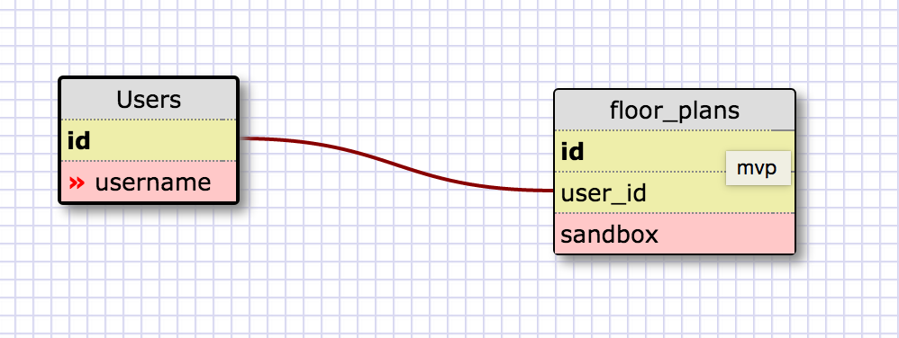
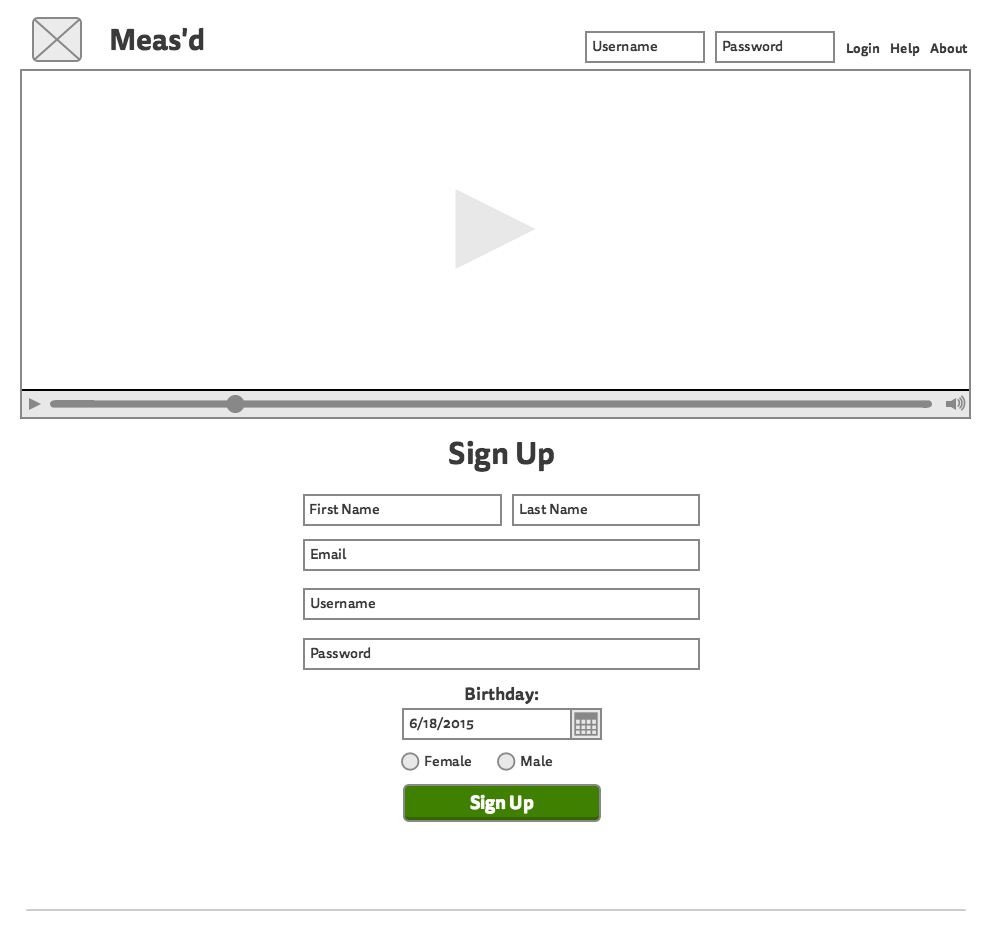

# Meas'd
DBC Final Project

"Smart Move"
This project's intent is to build an app that aids in the process of moving from start to finish.

Scope of the mvp:

1) General

  a) vision
    * Make planning your move fun
    * Measure twice, happy moving, no surprises

  b) values
    * Great/Attractive User Experience *
    * Learning new tech **
    * Front-end magic **
    * Math stuffs **
    * Agile process **
    * Respecting each other *
    * Positive experience for US *
    * Lots of communication, open expression *

  c) Working Agreement
              weekday     weekend
    * Majd:   9am-11pm    12pm-11pm
    * Ryan:   10am-11pm   12pm-11pm
    * Nate:   9am-9pm     11am-11pm
    * Katy:   8am-10pm     12pm+
      -K works beyond this remotely

  d) Work-life balance
    * K: foot MRI next week, yoga
    * R: gym, yoga
    * N: gym
    * M: gym, yoga, casual breaks

Stretch Features
  * The space inside moving trucks(3d)
  * The space inside a room/home(2d/3d)
    * Physical interaction w/ shapes representing furniture
    * Helps organize move w/ 2d grid, move to 3d

Rails app - Boostrap frontend styling?

Database Schema (mvp):

Wire Frame (mvp)

